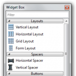
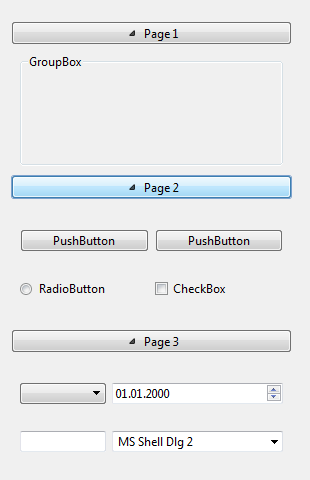
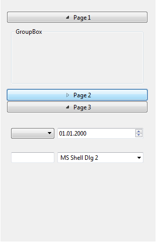

# WidgetBox
Widget Box is a Qt widget which contains a list of widgets (pages) separated by categories

Widget similar to the Widget Box in the Qt Designer. 

It contains a list of widgets (pages) separated by categories. Each category button can be clicked in order to expand and collapse the list below the button. Sample screenshots on moment of uploading to GitHub:

&nbsp;&nbsp;&nbsp;&nbsp;&nbsp;&nbsp;&nbsp;&nbsp;&nbsp;&nbsp;&nbsp;&nbsp;&nbsp;&nbsp;&nbsp;&nbsp;
